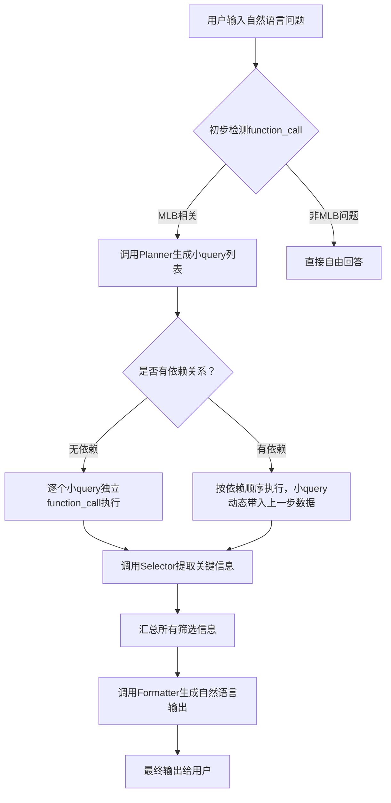

# MLB Function-Call Agent

一个基于 OpenAI Function Call 机制 + 自定义查询系统的 MLB 智能问答代理。
支持自然语言输入、查询任务规划、信息提取、自然语言输出。

---

## 📖 项目简介

本项目通过自然语言理解，结合 MLB 官方 API，分步规划查询任务，动态调用 function，智能筛选并组织结果，提供流畅自然的回答。

特点：

- 自然语言问题自动拆解成小查询
- 支持复杂问题的分步推理
- 查询结果自动筛选关键内容
- 结果自然语言总结
- 支持小查询之间的依赖关系处理

---

## 📂 文件结构

```bash
mlb-function-call/
├── app.py                   # 主程序入口，负责整体流程调度
├── mlb_query/
│   ├── dispatcher.py         # 根据function_name调度实际查询执行
│   ├── function_schema.py    # 定义所有支持的function列表（schema）
│   ├── planner.py            # 任务规划器，生成小query列表及依赖关系
│   ├── functions/
│   │   ├── player.py         # 球员查询相关function
│   │   ├── team.py           # 球队查询相关function
│   │   └── game.py           # 比赛查询相关function（可扩展）
├── utils/
│   ├── selector.py           # 从原始查询结果中筛选关键信息
│   ├── formatter.py          # 组织所有筛选信息生成自然语言输出
├── README.md                 # 本说明文档
└── requirements.txt          # 依赖包列表
```

---

## 🧩 各文件作用

| 文件 | 作用 |
|:---|:---|
| app.py | 主控制流程：输入处理、planner调用、小query分步执行、结果整理 |
| dispatcher.py | 本地执行function查询 |
| function_schema.py | 注册支持的function，包括参数定义和用途说明 |
| planner.py | 将用户自然语言问题，拆解为小query列表（支持依赖标记） |
| functions/player.py | 访问MLB API查询球员资料 |
| functions/team.py | 查询球队基本信息 |
| functions/game.py | 查询比赛结果等 |
| selector.py | 筛选和用户提问最相关的信息字段 |
| formatter.py | 整理成自然流畅的回答文本 |

---

## 🚀 主程序运行流程（详细版）



---

## 🧠 依赖关系处理机制

- planner在输出小query时，同时标记 `depends_on`
- app.py按照顺序执行：
  - 无依赖query直接执行
  - 有依赖query动态注入上游结果再执行
- 支持跨步推理，例如先查球队列表再查球队详情

---

## ✨ 示例使用场景

- 查询球员基本资料
- 查询球队在某个赛季的战绩
- 比较同一球员在不同球队时期的打击数据
- 分析分区排名变化

---

## ⚙️ 安装与运行

```bash
# 克隆仓库
git clone https://github.com/yourname/mlb-function-call.git

# 进入项目目录
cd mlb-function-call

# 安装依赖
pip install -r requirements.txt

# 设置OpenAI API Key
export OPENAI_API_KEY=你的API密钥

# 运行主程序
python app.py
```

---

## 📢 注意事项

- 本项目依赖 MLB 官方公开API，查询结果受限于API数据更新频率
- 本项目示例使用 OpenAI `gpt-4o`
- 本项目仅供学习与研究，非商业用途

---

## 📬 联系与反馈

欢迎提出建议与改进想法！