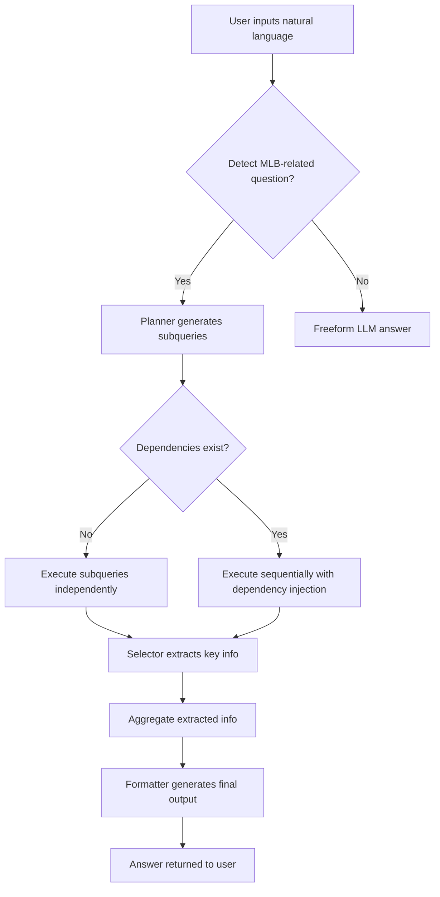

# MLB Function-Call Agent

An intelligent question-answering agent based on OpenAI Function Calling + customized MLB query system.

Supports natural language input, multi-step query planning, data extraction, and fluent answer generation.

---

## Project Overview

This project processes natural language questions about Major League Baseball (MLB), breaks them down into small query steps, dynamically invokes registered functions based on the OpenAI Function Calling mechanism, and returns concise, natural answers.

Key Features:

- Automatically decomposes complex questions into subqueries
- Supports multi-step reasoning and dependency resolution
- Extracts key information from raw API results
- Summarizes answers into fluent natural language
- Supports chaining dependent queries

---

## Module Responsibilities

| File | Purpose |
|:---|:---|
| app.py | Main workflow controller: handles input, planning, execution, and output |
| dispatcher.py | Executes function calls locally |
| function_schema.py | Registers supported functions and their parameters |
| planner.py | Translates natural language input into structured subqueries |
| functions/player.py | MLB API integration for player-related data |
| functions/team.py | Retrieves team-related data |
| functions/game.py | Handles game-related queries |

---

## Main Execution Flow



---

## Dependency Resolution

- The planner marks `depends_on` for each subquery
- The app executes subqueries in order:
  - Independent ones first
  - Dependent ones with previous result injection
- Enables multi-step reasoning like "find teams → get team details"

---

## Example Use Cases

- Retrieve player profiles
- Query team standings in a given season
- Compare a player’s performance across teams
- Analyze division rankings over time

---

## Setup & Run

```bash
git clone https://github.com/yourname/mlb-function-call.git
cd mlb-function-call
pip install -r requirements.txt
export OPENAI_API_KEY=your-key
python app.py
```

---

## Notes

- Relies on MLB public API ([https://github.com/toddrob99/MLB-StatsAPI/wiki/All-Functions](#))
- Designed to work with OpenAI `gpt-4o`
- For research and educational use only

---

## Limitations & Reflections

While this project successfully demonstrates how OpenAI Function Calling can drive multi-step, structured interaction with a live API, it also reveals important limitations of current function-based LLM architectures:

- **Lack of true reasoning**: The model often struggles to understand context over multiple steps, especially when it needs to extract or infer values from previous outputs (e.g., game ID or team ID).
- **Poor robustness**: A single missing field or planning mistake (e.g., date not found, wrong team format) can cause the entire chain to fail, as no fallback or repair mechanism exists.
- **Planning brittleness**: Task decomposition is done in one-shot; there's no iterative correction if steps are poorly formed or fail downstream.
- **No memory or recovery**: The system lacks a persistent state or memory, making it hard to replan or adjust when something goes wrong mid-execution.

These limitations suggest that while Function Calling is useful for **controlled task execution**, building **truly robust agents** may require more advanced orchestration frameworks (e.g., RAG pipelines, toolformer-style dynamic calls, or LangGraph-style state machines).
